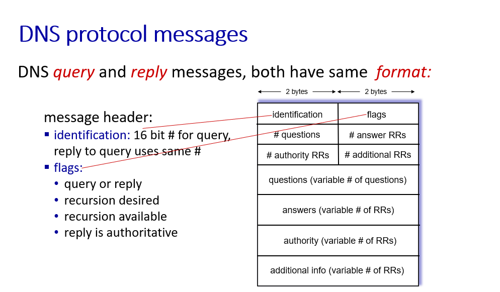
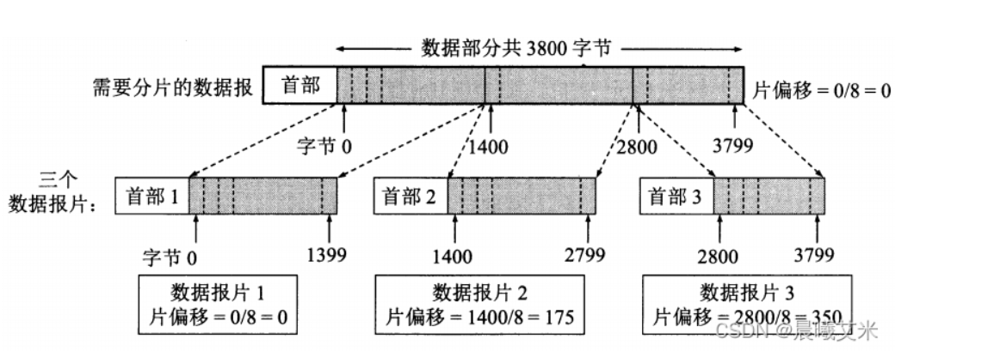
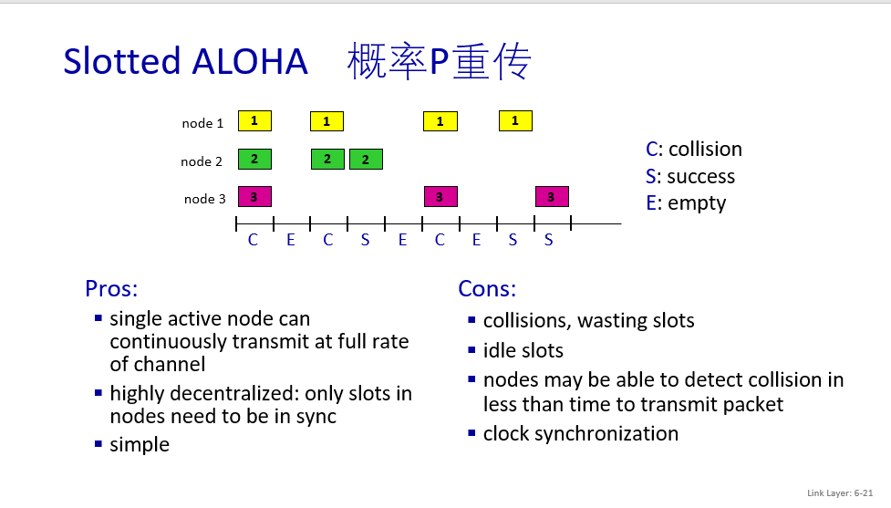

#    网络分层的优点：

​    1）各层之间是独立的。某一层并不需要知道它下一层是如何实现的，而仅仅需要知道该层通过层间的接口所提供的服务。由于每一层只实现一种相对独立的功能，因而可以将一个难以处理的复杂问题分解为若干个较容易处理的更小问题，这样，整个问题的复杂度就下降了。

​    2）灵活性好。当任何一层发生变化时，只要层间接口关系保持不变，则在这层以上或以下各层均不受影响，此外，对某一层提供的服务还可以进行修改。当某层提供的服务不再需要时，甚至可以将这层取消。

​    3）结构上可分割开。各层都可以采用最合适的技术来实现。

​    4）易于实现和维护。这种结构使得实现和调试一个庞大而又复杂的系统变得易于处理，因为整个系统已被分解为若干个相对独立的子系统。

​    5）能促进标准化工作。因为每一层的功能及其所提供的服务都已有了精确的说明。


# http 1.0、1.1、 2.0


## 总结

http 1.1**优点**：

引入了**持久连接**，不用每一次请求一个文件就建立一次tcp。

引入了**范围请求**（range头域），允许只返回资源的某个部分，支持断点续传

引入了**管道机制**，支持client同时发送多个请求


http 1.1**缺点**：

服务器的请求是按照请求顺序相应的（**FIFO**），如果服务器响应慢，就一直请求不到数据，**队头 阻塞**。

头部冗余


http 2.0**优点**：

头部压缩，维护一张头信息表，如果header是一样的，那么就不发送了，直接发送表里边的索引

引入顺序字段，标记了每个数据包是第几个

引入了多路复用，client和server都可以同时发送多个请求和相应，不用考虑顺序，大大减少了延迟


http 2.0**缺点**：

可能会队头阻塞，因为多个http复用一个tcp连接，一旦发生丢包，就会触发tcp的重传机制，所有的http请求都要等待这个丢了的包重传回来


http3.0**优点**：

使用udp而不是tcp，不用三次握手，快

不会发生丢包重传的等待现象，如果某个流发生丢包了，只会阻塞这个流

## 详细


1. **缓存处理：**HTTP/1.0 使用 `Pragma:no-cache + Last-Modified/If-Modified-Since`来作为缓存判断的标准；HTTP/1.1 引入了更多的缓存控制策略：`Cache-Control`、`Etag/If-None-Match`等。

2. 错误状态管理：HTTP/1.1新增了24个错误状态响应码，如409（Conflict）表示请求的资源与资源的当前状态发生冲突；410（Gone）表示服务器上的某个资源被永久性的删除。

3. **范围请求：**HTTP/1.1在请求头引入了`range`头域，它允许只请求资源的某个部分，即返回码是206（Partial Content），这样就方便了开发者自由的选择以便于充分利用带宽和连接，支持断点续传。

4. Host头：HTTP1.0中认为每台服务器都绑定一个唯一的IP地址，因此，请求消息中的URL并没有传递主机名（hostname）。但随着虚拟主机技术的发展，在一台物理服务器上可以存在多个虚拟主机（Multi-homed Web Servers），并且它们共享一个IP地址。HTTP1.1的请求消息和响应消息都应支持Host头域，且请求消息中如果没有Host头域会报告一个错误（400 Bad Request）。有了Host字段，就可以将请求发往同一台服务器上的不同网站，为虚拟主机的兴起打下了基础。

5. **持久连接：**HTTP/1.1 最大的变化就是引入了持久连接（persistent connection），在HTTP/1.1中默认开启 `Connection: keep-alive`，即TCP连接默认不关闭，可以被多个请求复用。

客户端和服务器发现对方一段时间没有活动，就可以主动关闭连接。不过，规范的做法是，客户端在最后一个请求时，发送Connection: close，明确要求服务器关闭TCP连接。客户端和服务器发现对方一段时间没有活动，就可以主动关闭连接。不过，规范的做法是，客户端在最后一个请求时，发送`Connection: close`，明确要求服务器关闭TCP连接。

6. **管道机制：**HTTP/1.1中引入了管道机制（pipelining）,即在同一个TCP连接中，客户端可以**同时**发送多个请求。


http 1.1的缺点：可能发生队头阻塞，因为所有的数据通信都是按照次序完成的，只有处理完一个请求，才能处理下一个，如果client需要A、B两个资源，pipeline允许client同时发送A和B的请求，但服务器仍然会按照顺序，先回应A、再对应B，因此可能造成堵塞


HTTP/2以Google发布的SPDY协议为基础，于2015年发布。它不叫HTTP/2.0，因为标准委员会不打算再发布子版本了，下一个新版本将是HTTP/3。HTTP/2协议只在HTTPS环境下才有效，升级到HTTP/2，必须先启用HTTPS。HTTP/2解决了HTTP/1.1的性能问题，主要特点如下：

1. 二进制分帧：HTTP/1.1的头信息是文本（ASCII编码），数据体可以是文本，也可以是二进制；HTTP/2 头信息和数据体都是二进制，统称为“帧”：头信息帧和数据帧；

2. **多路复用（双工通信）：**通过单一的 HTTP/2 连接发起多重的请求-响应消息，即在一个连接里，客户端和浏览器都可以同时发送多个请求和响应，而不用按照顺序一一对应，这样避免了“队头堵塞”。HTTP/2 把 HTTP 协议通信的基本单位缩小为一个一个的帧，这些帧对应着逻辑流中的消息。并行地在同一个 TCP 连接上双向交换消息。

3. **数据流：**因为 HTTP/2 的数据包是不按顺序发送的，同一个连接里面连续的数据包，可能属于不同的回应。因此，必须要对数据包做标记，指出它属于哪个回应。HTTP/2 将每个请求或回应的所有数据包，称为一个数据流（stream）。每个数据流都有一个独一无二的**编号**。数据包发送的时候，都必须标记数据流ID，用来区分它属于哪个数据流。另外还规定，客户端发出的数据流，ID一律为奇数，服务器发出的，ID为偶数。数据流发送到一半的时候，客户端和服务器都可以发送信号（`RST_STREAM`帧），取消这个数据流。HTTP/1.1取消数据流的唯一方法，就是关闭TCP连接。这就是说，HTTP/2 可以取消某一次请求，同时保证TCP连接还打开着，可以被其他请求使用。客户端还可以指定数据流的优先级。优先级越高，服务器就会越早回应。

4. 首部压缩：HTTP 协议不带有状态，每次请求都必须附上所有信息。所以，请求的很多字段都是重复的，，一模一样的内容，每次请求都必须附带，这会浪费很多带宽，也影响速度。HTTP/2 对这一点做了优化，引入了头信息压缩机制（header compression）。一方面，头信息压缩后再发送（SPDY 使用的是通用的DEFLATE 算法，而 HTTP/2 则使用了专门为首部压缩而设计的 HPACK 算法）。；另一方面，客户端和服务器同时维护一张头信息表，所有字段都会存入这个表，生成一个索引号，以后就不发送同样字段了，只发送索引号，这样就提高速度了。

5. 服务端推送：HTTP/2 允许服务器未经请求，主动向客户端发送资源，这叫做服务器推送（server push）。常见场景是客户端请求一个网页，这个网页里面包含很多静态资源。正常情况下，客户端必须收到网页后，解析HTML源码，发现有静态资源，再发出静态资源请求。其实，服务器可以预期到客户端请求网页后，很可能会再请求静态资源，所以就主动把这些静态资源随着网页一起发给客户端了。


一个端口不能供多个程序使用，但是一个socket可以供多个进程使用。socket包含了端到端的4元组信息


## 可持续http和不可持续http


## http报文格式


## cookie流程


# SMTP过程


- 连接建立

```
SMTP客户和SMTP服务器首先要建立TCP连接。

 1. 从客户端使用熟知端口号25建立与服务器的TCP连接，SMTP服务器向该客户送回应答码220，并且还为客户端提供了服务器的域名
 2. 客户端收到应答码后，发送HELO命令，启动客户端和服务器之间的SMTP会话。该客户端发送的HELO用来向服务器提供客户端的标识信息
 3. 服务器端回应应答码250，通知客户端：请求建立邮件服务会话已经实现

```


- 报文发送

  ```
  在SMTP客户与SMTP服务器之间的连接建立之后，发信的用户就可以与一个或多个收信人交换邮件报文了。
  
   1. 客户用“MAIL ＦＲＯＭ”向服务器报告发信人的邮箱与域名
   2. 服务器向客户回应应答码“250”，代表请求命令完成
   3. 客户用“RCPT TO”命令向服务器报告收信人的邮箱与域名
   4. 服务器向客户回应应答码“250”，代表请求命令完成
   5. 客户用“DTAT”命令对报文的传送进行初始化
   6. 服务器回应“354”，表示可以进行邮件输入了
   7. 客户用连续的行向服务器传送报文的内容，每行以两字符的行结束标识（CR与LF）终止。报文以只有一个“.”的行结束
   8. 服务器向客户回应应答码“250”，代表请求命令完成
  
  ```

  

- 连接终止

  ```
  报文发送完毕后终止本次SMTP会话。
  
   - 客户端发送“QUIT”命令
   - 服务器收到命令后，回应应答码“221”，并结束会话
  
  ```

  

## ICANN

ICANN (Internet Corporation for Assigned Names and Numbers) manages root DNS domain


# dns报文格式



```
Domain Name System (query)
    Transaction ID: 0x9ad0                              #事务ID
    Flags: 0x0000 Standard query                        #报文中的标志字段
        0... .... .... .... = Response: Message is a query
                                                        #QR字段, 值为0, 因为是一个请求包
        .000 0... .... .... = Opcode: Standard query (0)
                                                        #Opcode字段, 值为0, 因为是标准查询
        .... ..0. .... .... = Truncated: Message is not truncated
                                                        #TC字段
        .... ...0 .... .... = Recursion desired: Don't do query recursively 
                                                        #RD字段
        .... .... .0.. .... = Z: reserved (0)           #保留字段, 值为0
        .... .... ...0 .... = Non-authenticated data: Unacceptable   
                                                        #保留字段, 值为0
    Questions: 1                                        #问题计数, 这里有1个问题
    Answer RRs: 0                                       #回答资源记录数
    Authority RRs: 0                                    #权威名称服务器计数
    Additional RRs: 0                                   #附加资源记录数
```


# dns过程

咱们以访问 `www.163.com` 这个域名为例，来看一看当你访问 www.163.com 时，会发生哪些事：

1. 先查找本地 DNS 缓存（自己的电脑上），有则返回，没有则进入下一步
2. 查看本地 hosts 文件有没有相应的映射记录，有则返回，没有则进入下一步
3. 向本地 DNS 服务器（一般都是你的网络接入服务器商提供，比如中国电信，中国移动）发送请求进行查询，本地DNS服务器收到请求后，会先查下自己的缓存记录，如果查到了直接返回就结束了，如果没有查到，本地DNS服务器就会向DNS的根域名服务器发起查询请求：请问老大， `www.163.com` 的ip是啥？
4. 根域名服务器收到请求后，看到这是个 `.com` 的域名，就回信说：这个域名是由 `.com` 老弟管理的，你去问他好了，这是`.com`老弟的联系方式（ip1）。
5. 本地 DNS 服务器接收到回信后，照着老大哥给的联系方式（ip1），马上给 `.com` 这个顶级域名服务器发起请求：请问 `.com` 大大，`www.163.com` 的ip 是啥？
6. `.com` 顶级域名服务器接收到请求后，看到这是 `163.com` 的域名，就回信说：这个域名是 `.163.com` 老弟管理的，你就去问他就行了，这是他的联系方式（ip2）
7. 本地 DNS 服务器接收到回信后，按照前辈的指引（ip2），又向 `.163.com` 这个权威域名服务器发起请求：请问 `163.com` 大大，请问 `www.163.com` 的ip是啥？
8. `163.com` 权威域名服务器接收到请求后，确认了是自己管理的域名，马上查了下自己的小本本，把 `www.163.com` 的ip告诉了 本地DNS服务器。
9. 本地DNS服务器接收到回信后，非常地开心，这下总算拿到了`www.163.com`的ip了，马上把这个消息告诉了要求查询的客户（就是你的电脑）。由于这个过程比较漫长，本地DNS服务器为了节省时间，也为了尽量不去打扰各位老大哥，就把这个查询结果偷偷地记在了自己的小本本上，方便下次有人来查询时，可以快速回应。


# dns 单个域名可以对应多个ip地址的原因（好处）

服务器将根据各地的访问IP，到达域名IP中路由跳数最小的那个IP地址作为访问的域名IP地址。这样能保证一个域名被访问时，能最大限度提供高速稳定的访问体验。同时，由于有多个备选IP，当其中一个出现问题时，可以实现故障自动切换，提高业务可用性，并提高资源利用率。

反过来，一个IP地址可以解析绑定多个域名，没有限制。但是宵云网络建议各位站长不要将同质化严重的网站绑定在同一个IP下，这样容易被搜索引擎判定作弊。


# DASH


什么是DASH
一种服务端、客户端的流媒体解决方案：
服务端：
将视频内容分割为一个个分片，每个分片可以存在不同的编码形式（不同的codec、profile、分辨率、码率等）；
播放器端：
就可以根据自由选择需要播放的媒体分片；可以实现adaptive bitrate streaming技术。不同画质内容无缝切换，提供更好的播放体验。


## dash工作原理

Server端将媒体文件切割一个个时间长度相等的切片（Segment），每个切片被编码为不同的码率/分辨率。
Client端通过评估自身的性能和带宽情况，下载相应码率和分辨率的切片。带宽好，下载码率高的切片；带宽差，下载码率低的切片。
因为不同质量的切片在时间上是对齐的，所以在不同质量的切片之前切换的话，自然是顺畅的，从而达到无缝切换的效果。


## UDP checksum计算

1、 先将需要计算`checksum`数据中的checksum设为0；
2、 计算checksum的数据按2byte划分开来，每2byte组成一个16bit的值，如果最后有单个byte的数据，补一个byte的0组成2byte；
3、 将所有的16bit值累加到一个32bit的值中；
4、 将32bit值的高16bit与低16bit相加到一个新的32bit值中，若新的32bit值大于0Xffff,
再将新值的高16bit与低16bit相加；
5、 将上一步计算所得的16bit值按位取反，即得到checksum值，存入数据的checksum字段即可

**计算例子：**
如计算下面一段数据的checksum，数据为16进制；
45 00 00 3c 00 00 00 00 40 11 6d 36 c0 a8 2b c3 08 08 08 08 11
红色的6d 36为checksum字段，先把checksum设0，数据分组，补0，整理完后数据如下，中间checksum设置为0，最后补1byte 0；
4500 003c 0000 0000 4011 0000 c0a8 2bc3 0808 0808 1100
计算：4500+003c+0000+0000+4011+0000+c0a8+2bc3+0808+0808+1100 = 192C8
高低16bit相加： 1 + 92C8 = 92C9
取反： ~92C9 = 6D36
最后所得数据为：45 00 00 3c 00 00 00 00 40 11 6d 36 c0 a8 2b c3 08 08 08 08 11


## tcp与udp区别

1、TCP与UDP区别总结：
1、 TCP面向连接 （如打电话要先拨号建立连接）; UDP是无连接 的，即发送数据之前不需要建立连接
2、TCP提供可靠的服务。也就是说，通过TCP连接传送的数据，无差错，不丢失，不重复，且按序到达;UDP尽最大努力交付，即不保证可靠交付

Tcp通过校验和，重传控制，序号标识，滑动窗口、确认应答实现可靠传输。如丢包时的重发控制，还可以对次序乱掉的分包进行顺序控制。

3、UDP具有较好的实时性，工作效率比TCP高，适用于对高速传输和实时性有较高的通信或广播通信。

4.每一条TCP连接只能是点到点的;UDP支持一对一，一对多，多对一和多对多的交互通信

5、TCP对系统资源要求较多，UDP对系统资源要求较少。


2、为什么UDP有时比TCP更有优势?

UDP以其简单、传输快的优势，在越来越多场景下取代了TCP,如实时游戏。

（1）网速的提升给UDP的稳定性提供可靠网络保障，丢包率很低，如果使用应用层重传，能够确保传输的可靠性。

（2）TCP为了实现网络通信的可靠性，使用了复杂的拥塞控制算法，建立了繁琐的握手过程，由于TCP内置的系统协议栈中，极难对其进行改进。

采用TCP，一旦发生丢包，TCP会将后续的包缓存起来，等前面的包重传并接收到后再继续发送，延时会越来越大，基于UDP对实时性要求较为严格的情况下，采用自定义重传机制，能够把丢包产生的延迟降到最低，尽量减少网络问题对游戏性造成影响。


# RDT


## RDT 1.0 2.0 3.0


参考文章：https://blog.csdn.net/qq_33936481/article/details/53152903


### rdt 1.0

假设底层信道是**完全可靠**的，传输的数据不会损坏或者丢失，这种理想情况下的协议十分简单，sender端和receiver端如下：

发送端等待上层传数据传进来，将数据打包为分组并将其发送到信道中。

接收端收到分组以后，将封包解开，将其发送到上层应用。


### rdt2.0

rdt 2.0修复了可能的bit差错

假设底层信道是具有**比特差错**信道，sender端和receiver端如下：


发送端等待上层传数据传进来，将数据和检验和打包为分组并将其发送到信道中然后等待，如果接受到ACK则数据无误，回到等待调用状态，如果收到NAK则说明发送的数据有误则进行重传。

接收端收到资料，会有ACK(肯定确认)与NAK(否定确认请重传)两种讯息，当数据分组接收到以后确认无误，会发送ACK给发送方已确定数据无误。当发现有错误时，会传回NAK通知发送端重传。


###   rdt2.1

rdt2.1修复了rdt 2.0中ACK/NAK的可能出错，且接受方不知道sender发过来的是新的，还是因为重传来的，因此需要有编号


针对rdt2.0中ACK/NAK受损可能会导致重传的问题，rdt2.1加入了序列号机制(sequence number)，分组的号码可以让发送方知道是否需要重传以及让接收方确认这是否是一次重新传输的分组。sender端和receiver端如下：


- 两个序列号(0, 1)就够用，为什么？因为rdt采用的是**停等协议**，因此接收方可以通过这一位知道发送方是否正在重传前一个发送的分组，或是一个新的分组，即双方都只知道新的1个和前1个共2个分组。


### rdt2.2


一次使用两种确认信息ACK，NAK处理起来比较费力，因此rdt2.2中移除NAK的信息，在ACK中加入编号就可以达到确认与否认的效果。发送方必须检查接收到的ACK中的报文中被确认的分组序号。sender端和receiver端如下：


### rdt3.0


假设底层信道是具有**比特差错和丢包**的信道，除了使用rdt2.2的机制，另外在发送端增加多了到技术定时器，封包送出去如果超时仍未收到ACK或是收到不正确编号的ACK，则重发。sender端如下：


对于rdt3.0的receiver端，在Computer_Networking_A_Top-Down_Approach这本书中没有提及，但是根据我个人理解，rdt3.0的receiver端与rdt2.2相比没有任何变化，因为rdt3.0只是在rdt2.2的基础上在sender端增加了计时器的功能。所以rdt3.0的receiver端(笔者根据rdt2.2的receiver重新做了一份)如下：


# 三次握手


## 过程
第一次握手: 客户端发送syn标志位和seq num，向服务器申请建立连接，客户端状态由closed变为syn_send

第二次握手: 服务端返回 syn和ack标志位，ack num以及seq num，确认第一次握手的报文段，返回ack num=seq num(第一次握手发送的)+1，同意建立连接，服务器状态由listen变为syn_received

第三次握手: 发送确认报文段，返回ack以及ack num=seq num(第二次握手发送的)+1，客户端状态变为：established(完成连接)

最后: 服务器收到确认报文段，服务器状态由syn_received变为established(完成连接)


## 原因


### 防止重复连接

RFC 793 - Transmission Control Protocol 其实就指出了三次握手的主要原因，它的描述如下

The principle reason for the three-way handshake is to prevent old duplicate connection initiations from causing confusion

中文的意思是，三次握手的主要原因是为了防止旧的重复连接引起连接混乱问题

比如在网络状况比较复杂或者网络状况比较差的情况下，发送方可能会连续发送多次建立连接的请求。如果 TCP 握手的次数只有两次，那么接收方只能选择接受请求或者拒绝接受请求，但它并不清楚这次的请求是正常的请求，还是由于网络环境问题而导致的过期请求，如果是过期请求的话就会造成错误的连接

所以如果 TCP 是三次握手的话，那么客户端在接收到服务器端 SEQ+1 的消息之后，就可以判断当前的连接是否为历史连接，如果判断为历史连接的话就会发送终止报文（RST）给服务器端终止连接；如果判断当前连接不是历史连接的话就会发送指令给服务器端来建立连接


### 同步初始化序列化

TCP 的一个重要特征就是可靠性，而 TCP 为了保证在不稳定的网络环境中构建一个稳定的数据连接，它就需要一个“序列号”字段来保证自己的稳定性，而这个序列号的作用就是防止数据包重复发送，以及有效的解决数据包接收时顺序颠倒的问题

在建立 TCP 连接时就需要同步初始化一个序列号来保证 TCP 的稳定性，因此它需要执行以下过程：

首先客户端发送一个携带了初始序列号的 SYN 报文给服务器端；

服务端接收到消息之后会回复一个 ACK 的应答报文，表示客户端的 SYN 报文已被服务端成功接收了；

而客户端收到消息之后也会发送一个 ACK 给服务端，服务器端拿到这个消息之后，我们就可以得到一个可靠的初始化序列号了。

而如果是两次握手的话，就无法进行序列号的确认工作了，因此也就无法得到一个可靠的序列号了，所以 TCP 连接至少需要三次握手


# 四次挥手


1）客户端进程发出连接释放报文，并且停止发送数据。释放数据报文首部，FIN=1，其序列号为seq=u（等于前面已经传送过来的数据的最后一个字节的序号加1），此时，客户端进入FIN-WAIT-1（终止等待1）状态。 TCP规定，FIN报文段即使不携带数据，也要消耗一个序号。
2）服务器收到连接释放报文，发出确认报文，ACK=1，ack=u+1，并且带上自己的序列号seq=v，此时，服务端就进入了CLOSE-WAIT（关闭等待）状态。TCP服务器通知高层的应用进程，客户端向服务器的方向就释放了，这时候处于半关闭状态，即客户端已经没有数据要发送了，但是服务器若发送数据，客户端依然要接受。这个状态还要持续一段时间，也就是整个CLOSE-WAIT状态持续的时间。
3）客户端收到服务器的确认请求后，此时，客户端就进入FIN-WAIT-2（终止等待2）状态，等待服务器发送连接释放报文（在这之前还需要接受服务器发送的最后的数据）。
4）服务器将最后的数据发送完毕后，就向客户端发送连接释放报文，FIN=1，ack=u+1，由于在半关闭状态，服务器很可能又发送了一些数据，假定此时的序列号为seq=w，此时，服务器就进入了LAST-ACK（最后确认）状态，等待客户端的确认。
5）客户端收到服务器的连接释放报文后，必须发出确认，ACK=1，ack=w+1，而自己的序列号是seq=u+1，此时，客户端就进入了TIME-WAIT（时间等待）状态。注意此时TCP连接还没有释放，必须经过2∗∗MSL（最长报文段寿命）的时间后，当客户端撤销相应的TCB后，才进入CLOSED状态。
6）服务器只要收到了客户端发出的确认，立即进入CLOSED状态。同样，撤销TCB后，就结束了这次的TCP连接。可以看到，服务器结束TCP连接的时间要比客户端早一些。


## 为什么连接的时候是三次握手，关闭的时候却是四次握手？


因为当Server端收到Client端的SYN连接请求报文后，可以直接发送SYN+ACK报文。其中ACK报文是用来应答的，SYN报文是用来同步的。但是关闭连接时，当Server端收到FIN报文时，很可能并不会立即关闭SOCKET，所以只能先回复一个ACK报文，告诉Client端，"你发的FIN报文我收到了"。只有等到我Server端所有的报文都发送完了，我才能发送FIN报文，因此不能一起发送。故需要四步握手。


## 为什么不用两次握手

答：3次握手完成两个重要的功能，既要双方做好发送数据的准备工作(双方都知道彼此已准备好)，也要允许双方就初始序列号进行协商，这个序列号在握手过程中被发送和确认。

   现在把三次握手改成仅需要两次握手，死锁是可能发生的。作为例子，考虑计算机S和C之间的通信，假定C给S发送一个连接请求分组，S收到了这个分组，并发 送了确认应答分组。按照两次握手的协定，S认为连接已经成功地建立了，可以开始发送数据分组。可是，C在S的应答分组在传输中被丢失的情况下，将不知道S 是否已准备好，不知道S建立什么样的序列号，C甚至怀疑S是否收到自己的连接请求分组。在这种情况下，C认为连接还未建立成功，将忽略S发来的任何数据分 组，只等待连接确认应答分组。而S在发出的分组超时后，重复发送同样的分组。这样就形成了死锁。


## tcp segment结构


**当接收方收到数据的时候，会根据序列号，按照顺序排列成一段**，因此序列号可以解决数据在网络发送的过程中出现乱序的问题。


tcp序列号：**一个报文段的序号是该报文段首字节的字节流的编号**


## go back n


## selective repeat

解决了go back n 的丢包的现象，返回的ack不再是收到的最大的包的编号，而是目前收到了哪个就返回哪个


## selective repeat的问题


回答：

```
Sequence# >= 2 * Window size

Suppose that the lowest-sequence number that the receiver is waiting for is packet m. In this case, its window is [m, m+w-1] and it has received (and ACKed) packet m-1 and the w-1 packets before that, where w is the size of the window. If the sender has yet received none of those w ACKs, then ACK messages with values of [m-w, m-1] may still be propagating back. If the sender has received no ACKs with these ACK numbers, then the sender's window would be [m-w, m-1]. 

Thus, the lower edge of the sender's window is m-w, and the leading edge of the receiver’s window is m+w-1. In order for the leading edge of the receiver's window to not overlap with the trailing edge of the sender's window, the sequence number space must thus be big enough to accommodate 2w sequence numbers. That is, the sequence number space must be at least twice as large as the window size, k ≥ 2w.

```


##   TCP congestion control: AIMD

TCP向网络发送第一个报文段并等待一个确认。当该确认到达时，TCP发送方将拥塞窗口增加一个 MSS，并发送出两个最大长度的报文段。这两个报文段被确认，则发送方对每个确认报文段将拥塞窗口增加一个 MSS，使得拥塞窗口变为 4 个MSS，并这样下去。这一过程每过一个 RR，发送速率就翻番。因此，TCP发送速率起始慢，但在慢启动阶段以指数增长。

何时结束这种指数增长呢？ 慢启动对该问题提供了几种答案：

首先，如果存在一个由超时指示的丢包事件（即拥塞），TCP发送方将cwnd 设置为1并重新开始慢启动过程。它还将第二个状态变量的值ssthresh（"慢启动阈值"的速记）设置为cwnd/2，即当检测到拥塞时将 ssthresh 置为拥塞窗口值的一半。

慢启动结束的第二种方式是直接与ssthresh的值相关联。因为当检测到拥塞时ssthresh设为cwnd的值一半，当到达或超过ssthresh的值时，继续使 cwnd 翻番可能有些鲁莽。因此，当 cwnd 的值等于 ssthresh 时，结束慢启动并且 TCP 转移到拥塞避免模式。将会看到，当进入拥塞避免模式时，TCP更为谨慎地增加 cwnd.

最后一种结束慢启动的方式是，如果检测到 3 个冗余ACK，这时 TCP 执行一种快速重传并进入快速恢复状态。

慢启动中的 TCP 行为总结在图3-51中的 TCP 拥塞控制的 FSM 描述中。

2、拥塞避免
一旦进入拥塞避免状态，cwnd 的值大约是上次遇到拥塞时的一半，即距离拥塞可能并不遥远！因此，TCP无法每过一个 RTT 再将 cwnd 的值翻番，而是采用了一种较为保守的方法，每个 RTT 只将 cwnd 的值增加一个 MSS。这能够以几种方式完成：

一种通用的方法是对于TCP发送方无论何时到达一个新的确认，就将cwnd增加一个 MSS（MSS/cwnd）字节。(例，如果MSS是1460字节且cwnd是14600字节，则在一个 RTT 内发送 10 个报文段。每个到达ACK（假定每个报文段一个ACK)增加 1/10MSS的拥塞窗口长度，因此在收到对所有 10 个报文段的确认后，拥塞窗口的值增加了一个 MSS。）
何时应当结束拥塞避免的线性增长呢(每 RTT 1MSS)?

当出现超时时， TCP的拥塞避免算法行为相同。与慢启动的情况一样， cwnd 的值被设为 1 个MSS，当丢包事件出现时，ssthresh 的值被更新为 cwnd 值的一半。

当丢包事件是由一个 3 个冗余ACK事件触发时，网络继续向发送方向接收方交付报文段（就像由收到冗余ACK所指示的那样）。因此，TCP对于这种丢包事件的行为，相比于超时指示的丢包，应当不那么剧烈：TCP将cwnd的值减半（为使测量结果更好，计及已收到的3个冗余的ACK要加上3个MSS），并且当收到3个冗余的ACK，将ssthresh的值记录为cwnd的值的一半。接下来接入快速恢复状态。

3、快速恢复
在快速恢复中，对于引起 TCP 进入快速恢复状态的缺失报文段，对收到的每个冗余的ACK，cwnd 的值增加一个 MSS。

最终，当对丢失报文段的一个 ACK 到达时，TCP 在降低 cwnd 后进入拥塞避免状态。

如果出现超时事件，快速恢复在执行如同在慢启动和拥塞避免中相同的动作后，迁移到慢启动状态：当丢包事件出现时，cwnd的值被设置为1个MSS，并且ssthresh的值设置为cwnd值的一半。

快速恢复是 TCP 推荐的而非必须的构件。有趣的是，一种称为 TCP Tahoe 的 TCP 早期版本，不管是发生超时指示的丢包事件，还是发生 3个冗余ACK指示的丢包事件，都无条件地将其拥塞窗口减至 1 个MSS，并进入慢启动阶段。TCP的较新版本 TCP Reno，则综合了快速恢复。


## tcp公平的前提


# 链路层


## switch fabric（交换结构）的三种类型


## output queuing 的buffer选择


# buffer management


## 通用转发的原因

基于目的地转发意味着什么? 这与通用转发有什么不同?

基于目的地的转发意味着到达[路由器](https://so.csdn.net/so/search?q=路由器&spm=1001.2101.3001.7020)的数据报将仅基于数据报的最终目的地被转发到输出接口。如果是根据目的地的IP地址转发的话, 路由转发表中可能需要有40多亿项. 当然可以通过匹配IP地址的最长前缀对所有IP地址进行分组. 但是这样的路由器功能太单一, 不具有普遍性。
通用转发意味着，除了其最终目的地外，当路由器确定数据报的输出接口时，还会考虑与数据报相关的其他因素。
通用转发延续了基于目的转发的"匹配+动作"模式, 但不受限于通过源分组的IP地址匹配目的IP地址进行转发, 而是通过富足首部字段值集合和计数器集合对动作集合进行匹配.
例如：软件定义网络SDN采用的是通用转发，例如，除了目标IP地址外，转发决策还可以基于数据报的TCP/UDP源或目标端口号


## 路由和转发的区别

转发是一个节点在本地执行的一个相对简单的过程，即报文从某台设备的一个端口进入而从另一个端口出去。路由选择依赖于网络发展过程中的不断演进的、复杂的分布式算法。最简单的路由选择可以决定报文发送的下一跳主机的地址，复杂的路由协议可以选择一条从主机1和主机2之间经过若干主机的路径。
转发表和路由表的区别：
1、转发表中的一行包括从网络号到发出接口的映射和一些MAC信息，而路由表作为建立转发表的前奏，是由路由选择算法建立的一个表，它通常包含从网络号到下一跳的映射。对于单个主机来说，转发表比路由表更详细；
2、二者建立的目的也不同：构造转发表－目的是为了优化转发分组时查找网络号的过程；优化路由表是为了计算拓扑结构的改变；
3、实现方式不同：转发表可以由特殊的硬件来实现，而路由表很少这样；


## ip数据报格式


### 标识（identification）

占2字节。网络层软件在存储器中维持一个计数器，每产生一个数据报，计数器就加1，并将此值赋给标识字段。但这个“标识”并不同于TCP首部中的序号，因为IP是无连接的服务，数据报不存在按序接收的问题。当数据报长度超过网络的MTU而必须分片时，这个标识字段的值就被复制到所有被分片报文片的标识字段中。相同的标识字段的值使分片后的各数据报片最后能正确地重装层原来的数据。


### 总长度

占2字节，指首部和数据之和的长度，单位为字节。能表示的最大长度为65535字节。在IP层下面的链路层协议规定了一个数据帧的数据字段的最大长度，这称为最大传输单元MTU（maximum transfer unit）。当一个IP数据报封装成链路层的帧时，此数据报的总长度（即首部加上数据部分）一定不能超过下面的链路层所规定的的MTU值。


### 片偏移

占13位。片偏移指出：较长的IP报文在分片后，某片在原分组中的相对位置。也就是说，相对于用户数据字段的起点，该片从何处开始。片偏移以8个字节为偏移单位。没片的长度一定是8字节的整数倍。

例如：一数据报的总长度为3820字节，数据部分为3800字节（IP首部为固定20字节），需要分片传输。假设每片IP报文长度不超过1420字节。去掉固定首部长度20字节，每片报文数据部分长度不超过1400。于是分成3个数据报片，其数据部分长度分别为1400、1400、100字节。原始数据报首部被复制为各数据报片的首部，只需要改变有关字段的值。





### 协议

占8位，协议字段指出此数据报携带的数据是使用何种协议（上面数据包中协议字段为6表示使用TCP协议），以便使用的目的主机的IP层知道应将数据部分上交给哪个协议进行处理。
常见的协议号：


 ### 首部检验和

占16位，也常成为校验和。这个字段只检验数据报的首部，但不包括数据部分（与UDP、TCP中的检验和不同）。IP数据报每经过一个路由器，路由器都需要重新计算一下首部检验和（IP首部中的TTL、标志、片偏移等都可能发生变化）。检验和的计算方式这里就不总结了。


ip头部长度是可变的，但是一般是20bytes


## subnet


## DHCP流程


**第一步：搜索阶段**

当DHCP客户端第一次登录网络的时候，计算机发现本机上没有任何IP地址设定，将以广播方式发送DHCP discover发现信息来寻找DHCP服务器，即向255.255.255.255发送特定的广播信息。网络上每一台安装了TCP/IP协议的主机都会接收这个广播信息，但只有DHCP服务器才会做出响应。（DHCP DISCOVER）

**第二步：提供阶段**
在网络中接收到DHCP discover发现信息的DHCP服务器就会做出响应，它从尚未分配的IP地址池中挑选一个分配给DHCP客户机，向DHCP客户机发送一个包含分配的IP地址和其他设置的DHCP offer提供信息。因为此时客户端还没有IP，所以返回信息也是以广播的方式返回的。（DHCP OFFER）

**第三步：选择阶段**
DHCP客户端接受到DHCP offer提供信息之后，选择第一个接收到的提供信息，然后以广播的方式回答一个DHCP request请求信息，该信息包含向它所选定的DHCP服务器请求IP地址的内容。（DHCP REQUEST）

**第四步：确认阶段**
当DHCP服务器收到DHCP客户端回答的DHCP request请求信息之后，便向DHCP客户端发送一个包含它所提供的IP地址和其他设置的DHCP ack确认信息，确认租约，并指定租约时长。告诉DHCP客户端可以使用它提供的IP地址。然后，DHCP客户机便将其TCP/IP协议与网卡绑定，另外，除了DHCP客户机选中的DHCP服务器外，其他的DHCP服务器将收回曾经提供的IP地址。（DHCP ACK）


## DHCP其余的作用


## network怎么获得子网部分的地址


## 地址分层的好处


更有效的进行路由，如果要更换ISP的话，只要更换一条线就行。


## 子网掩码

①、子网掩码（Subnet [Mask](https://so.csdn.net/so/search?q=Mask&spm=1001.2101.3001.7020)）又叫网络掩码、地址掩码，必须结合IP地址一起对应使用。
②、只有通过子网掩码，才能表明一台主机所在的子网与其他子网的关系，使网络正常工作。
③、子网掩码和IP地址做“与”运算，分离出IP地址中的网络地址和主机地址，用于判断该IP地址是在本地网络上，还是在远程网络网上。
④、子网掩码还用于将网络进一步划分为若干子网，以避免主机过多而拥堵或过少而IP浪费。


## NAT工作流程


上述客户机访问服务器为例，当仅有一台客户机访问服务器时，NAT Gateway只须更改数据包的源IP或目的IP即可正常通讯。但是如果Client A和Client B同时访问Web Server，那么当NAT Gateway收到响应包的时候，就无法判断将数据包转发给哪台客户机，如下图所示。


此时，NAT Gateway会在Connection Track中加入端口信息加以区分。如果两客户机访问同一服务器的源端口不同，那么在Track Table里加入端口信息即可区分，如果源端口正好相同，那么在时行SNAT和DNAT的同时对源端口也要做相应的转换，如下图所示。（这里的理解灰常重要）


###  NAT优缺点

 优点： NAT 不仅实现地址转换，同时还起到防火墙的作用，隐藏内部网络的拓扑结构，保护内部主机。 NAT 不仅完美地解决了 lP 地址不足的问题，而且还能够有效地避免来自网络外部的攻击，隐藏并保护网络内部的计算机。 这样对于外部主机来说，内部主机是不可见的。但是，对于P2P 应用来说，却要求能够建立端到端的连接，所以如何穿透NAT 也是P2P 技术中的一个关键。


缺点：

1. 溯源困难。由于经过多个 NAT 地址转换点，数据包地址已改变很多次，因此追溯数据包将更加困难，排除故障也更具挑战性。另一方面，试图确定数据包源的也会发现难以追溯或获得原始源地址或目的地址。
2. 使用 NAT 也会使隧道协议（例如 IPsec）更加复杂，因为 NAT 会修改报头中的值，从而干扰 IPsec 和其它隧道协议执行的完整性检查。
3. 许多 Internet 协议和应用程序依赖端到端功能，需要将未经修改的数据包从源转发到目的地。NAT 会更改端到端地址，因此会阻止一些使用 IP 寻址的应用程序。例如，一些安全应用程序（例如数字签名）会因为源 IP 地址改变而失败。使用物理地址而非限定域名的应用程序无法到达经过 NAT 路由器转换的目的地。有时，通过实施静态 NAT 映射可避免此问题。


## Generalized forwarding


### 流程


### 好处

1. 更通用
2. 更安全，可以做防火墙
3. 可扩展


## 数据包的格式


## CIDR

作用：CIDR是把几个标准网络合成一个大的网络


CIDR的全称是Classless Interdomain Routing，即无类别域间路由。子网使得我们将一个有类别的IP分割给多个子网，例如将一个B类网络段128.96，使用255.255.128.0可以划分成128.96.0.0-128.96.127.255（主网号128.96.0.0），128.96.128.0-128.96.255.255（主网号128.96.128.0）等多个部分。而CIDR使得我们可以将一些不同类别的IP地址合并为一个“超网（原书是superlet）”地址。

CIDR的做法是打破不同类别网络地址间的界限。考虑一个已经拥有16个C类网络转发表的路由，要实现CIDR先假设我们有这样连续的16个C类主网号，从192.4.16到192.4.31，观察这些网络号，从110 00000 00000100 00010000 到110 00000 00000100 00011111，可以发现它们的前20位是相同的，这实际上可以看成我们创建了某种介于B类和C类之间的网络，这种网络拥有20位的网络段（算上B类开头的‘10’或者C类开头的‘110’，B类是16位，C类是24位），12位的主机段。

如果这时我们要拓展网络的容量，要将这16个C类网络用1个B类网络表达，就会造成只有大约16*255/65536=6.2%的IP利用率。而如果使用这种特殊的20位网络段的地址，它的主机数是2^12-2，地址利用率大约是16*255/4096 = 99.6%。

为了标识这种特殊类别的网络，我们使用‘/x’的方式，x表示网络段的位数，（也是子网掩码中1的位数）。上面的20位网络段的网络就可以表示成192.4.16/20.这使得我们可以用一个特殊的网络号192.4.16/20来表示从192.4.16到192.4.31这16个网络，岂不美哉。（还可以这样理解，C类地址24位网络段，该网络20位网络段，即共有2^(24-20）个子网，我们在24位网络段的基础上少限制了4位，这4位用于标识子网。）

CIDR大大的提高了网络的可拓展性。对于128.112.128/21这样的特殊类别网络（当然其实我们还是叫它B类网络就是了），子网掩码现在可就好求多了，毕竟网络段1的个数我们都直接标注出来了……它的子网掩码网络段有21个1，即255.255.248。它拥有2^(24-21)共8个子网，那么这8个子网网络段就是从128.112.128/24到128.112.135/24，写的时候不要忘了加相应的后缀‘/24’。对于163.135.0.0/20，它的子网掩码255.255.240.0，拥有2^(24-20）共16个子网，那子网就是从163.135.0.0/24到163.135.15.0/24.

CIDR同时也解决了子网主机段不能全为0或者1的问题，因为128.112.128.0/21与128.112.128.0/24是两个不同的IP，不会再有重叠的问题。

CIDR的存在使得我们匹配IP地址的时候需要采用“最长匹配”的原则，例如171.69/16和171.69.10/24，地址171.69.10.5能同时匹配这两个网络段，最长匹配原则要求我们选择171.69.10/24作为目的地址。


## SDN

- 传统网络局限性：
  - 流量路径的灵活调整能力不足。
  - 网络协议实现复杂，运维难度较大。
  - 网络新业务升级速度较慢。


SDN的好处有哪些？

第一，设备硬件归一化,硬件只关注转发和存储能力，与业务特性解耦，可以采用相对廉价的商用的架构来实现。

第二， 网络的智能性全部由软件实现,网络设备的种类及功能由软件配置而定,对网络的操作控制和运行由服务器作为网络操作系统(NOS)来完成。

第三， 对业务响应相对更快,可以定制各种网络参数，如路由、安全、策略、QoS、流量工程等，并实时配置到网络中，开通具体业务的时间将缩短。


更轻松的网络管理：避免路由器配置错误，提高流量的灵活性

基于表的转发（调用OpenFlow API）允许“编程”路由器

负载均衡

集中式“编程”更容易：集中计算表并分发

分布式“编程”更加困难：计算表是每个路由器中实现的分布式算法（协议）的结果


## OSPF流程


# 控制平面


### 链路状态算法与距离向量算法之间的区别

链路状态算法（也称最短路径算法）发送路由信息到互联网上所有的结点，然而对于每个路由器，仅发送它的路由表中描述了其自身链路状态的那一部分。距离向量算法（也称为Bellman-Ford算法）则要求每个路由器发送其路由表全部或部分信息，但仅发送到邻近结点上。从本质上来说，链路状态算法将少量更新信息发送至网络各处，而距离向量算法发送大量更新信息至邻接路由器。 ——由于链路状态算法收敛更快，因此它在一定程度上比距离向量算法更不易产生路由循环。但另一方面，链路状态算法要求比距离向量算法有更强的CPU能力和更多的内存空间，因此链路状态算法将会在实现时显得更昂贵一些。除了这些区别，两种算法在大多数环境下都能很好地运行。  


## 数据平面和控制平面的区别

数据平面

 本地，每个路由器功能
 决定从路由器输入端口到达的分组如何转发到输出端口
 转发功能：
 传统方式：基于目标地址+转发表
 SDN方式：基于多个字段+流表

控制平面

 网络范围内的逻辑
 决定数据报如何在路由器之间路由，决定数据报从源到目标主机之间的端到端路径
 2个控制平面方法:
传统的路由算法: 在路由器中被实现
（就只能匹配路由表，做分组的转发）
software-defined networking (SDN): 在远程的服务器中实现
（Compare to the traditional routing algorithm，SDN is much more flexible.
SDN 可以多个动作：转发、Block、泛洪、修改某些字段…


##　控制平面和数据平面分离的优点

　假设这几个平面不进行任何的分离，数据平面和控制、管理平面使用共用的主机资源，在大数据流量、复杂应用环境下数据平面由于承担着繁重的日常任务将可能消耗绝大部分资源，这对于整个交换机系统无疑是灾难性的，因为在某些极端的情况下，控制平面将没有充分的资源来保障运行，这就意味网络设备失去了对设备所处网络环境的真实了解，网络设备将立即陷于非正常工作状态甚至瘫痪状态，而管理人员也没有资源使用管理平面对网络设备的运行进行干预，所以数据平面需要严格地与控制平面、管理平面进行分离。


控制平面和数据平面分离的优点在于，当需要转发的通信量剧增导致数据平面资源枯竭时，虽然无法继续进行分组转发，但对控制平面上的路由选择处理所涉及的资源没有任何影响。同样，当路由选择处理负载剧增导致控制平面资源枯竭时，也不会给数据平面的资源以及分组转发带来任何影响。


## 链路状态路由选择算法(dijkstra)例题


## 距离向量路由选择算法(bellman-ford)


## 距离向量路由选择算法和链路状态路由选择算法的比较


## BGP

域间路由协议


### 分类

eBGP:从相邻的自治系统获得子集可达信息

iBGP:将自己获得的信息传递给内部的所有结点


##  ICMP

网络层协议


### ICMP 功能

ICMP协议的功能主要有：

1. 确认IP包是否成功到达目标地址
2. 通知在发送过程中IP包被丢弃的原因


### ICMP过程


1.首先查本地arp cache信息，看是否有对方的mac地址和IP地址映射条目记录 
2.如果没有，则发起一个arp请求广播包，等待对方告知具体的mac地址 
3.收到arp响应包之后，获得某个IP对应的具体mac地址，有了物理地址之后才可以开始通信了,同时对ip-mac地址做一个本地cache 
4.发出icmp echo request包，收到icmp echo reply包
往往很多人都忽略了上面3步，只知道有最后一步。


一、ping程序可以测试一个给定的目的地是否可达
它发送一个包含ICMP回应请求(echo-request)的报文给目的地，然后等待一段很短的时间如果没有收到应答(echo-reply)，则重新传送请求如果重传的请求仍没有收到应答（或收到一个ICMP目的不可达报文），ping声称该远程机器为不可达。


二、用ICMP跟踪路由
路由跟踪（tracert）工具在构造一个通往给定目的地的路径上的所有路由器的列表时，用到了ICMP报文路由跟踪程序简单地发送一系列的数据报并等待每一个响应。
①在发送第一个数据报之前，将它的生存时间置为1 第一个路由器收到这一数据报会将生存时间减1 ，显然就会丢弃这一数据报，并发回一个ICMP超时报文由于ICMP报文是通过IP数据报传送的，因此路由跟踪可以从中取出IP源地址，也就是去往目的地的路径上的第一个路由器的地址。
②得到第一个路由器的地址之后，路由跟踪会发送一个生存时间为2 的数据报第一个路由器将计时器减1 并转发这一数据报，第二个路由器会丢弃这一数据报并发回一个超时报文类似的，一旦跟踪路由程序收到距离为2的路由器发来的超时报文，它就发送生存时间为3 的数据报，然后是4 ，等等。


# 链路层


## 访问www.google.com会发生什么？


## 为什么我们需要链路级和端-端可靠性？

3个答案。之所以需要端到端，是因为并非所有网络层都特别可靠，只有端系统知道真正需要多少可靠性。链路层可靠性通常用于容易出现高错误率的链路，如无线链路等。如果整个重新传一遍成本太高了，也容易再次出错。


## CRC 循环冗余校验


## slotted aloha




难点：怎么进行时间上的同步

## pure aloha


## CSMA-CD 载波侦听检测协议


### CSMA CD过程


### CSMA CD效率


## 二进制指数回退


## switch 工作过程


## router和switch区别


## MAC协议总结


## ARP作用

总结：给出一个ip和port，找到对应的MAC地址

在网络 通讯时，源主机的应用程序知道目的主机的IP地址和端口号，却不知道目的主机的硬件地址，而数据包首先是被网卡接收到再去处理上层协议的，如果接收到的数据包的硬件地址与本机不符，则直接丢弃。因此在通讯前必须获得目的主机的硬件地址。

APR 就是实现这个功能的协议。

地址解析协议 ARP 作用：在主机 ARP 高速缓存中存放一个从 IP 地址到硬件地址的映射表，并且这个映射表经常动态更新。每一台主机都设有一个 ARP 高速缓存(ARP Cache)，里面有本局域网上的各主机和路由器的 IP 地址到硬件地址的映射表(并且每一个映射地址都设置有生存时间)。


## ARP工作过程

使用 ARP 的四种典型情况：


（1）发送方是主机(如H1)，要把 IP 数据报发送到同一个网络上的另一台主机(如H2)。这时H1先查看自身 ARP 缓存表是否有 H2 硬件地址，有的话则直接发送。若没有则发送 ARP 请求分组(在网1上广播)，找到目的主机 H2 的硬件地址。
（2）发送方是主机(如H1)，要把 IP 数据报发送到另一个网络上的一台主机(如H3或H4)。这时发送 ARP 请求分组(在网1上广播)，找到网1上的一个路由器 R1 的硬件地址。剩下的工作由路由器 R1 来完成。R1 要做的事情是下面的（3）或（4）。
（3）发送方是路由器(如R1)，要把 IP 数据报转发到与 R1 连接在同一个网络(网2)上的主机(如H3)。这时 R1 发送 ARP 请求分组(在网2上广播)，找到目的主机 H3 的硬件地址。

注意：发送给R1的是报文，不是arp查询请求

（4）发送方是路由器(如R1)，要把 IP 数据报转发到网3上的一台主机(如H4)。H4与 R1 不是连接在同一个网络上。这时 R1 发送 ARP 请求分组(在网2上广播)，找到连接在网 2 上的一个路由器 R2 的硬件地址。剩下的工作由这个路由器 R2来完成

上面是如何查找MAC 地址，下面结合消息发送，完整的场景如下。


如图所示：


假设主机A和B在同一个网段，主机A要向主机B发送信息，具体的地址解析过程如下：

(1) 主机A首先查看自己的ARP表，如果ARP表中含有主机B对应的ARP表项，则主机A直接利用ARP表中的MAC地址，对IP数据包进行帧封装，并将数据包发送给主机B。

(2) 如果主机A在ARP表中找不到对应的MAC地址，则将缓存该数据报文，然后以广播方式发送一个ARP请求报文。ARP请求报文中的发送端IP地址和发送端MAC地址为主机A的IP地址和MAC地址，目标IP地址和目标MAC地址为主机B的IP地址和全0的MAC地址。由于ARP请求报文以广播方式发送，该网段上的所有主机都可以接收到该请求，但只有被请求的主机（即主机B）会对该请求进行处理。

(3) 主机B比较自己的IP地址和ARP请求报文中的目标IP地址，当两者相同时进行如下处理：将ARP请求报文中的发送端（即主机A）的IP地址和MAC地址存入自己的ARP表中。之后以单播方式发送ARP响应报文给主机A，其中包含了自己的MAC地址。

(4) 主机A收到ARP响应报文后，将主机B的MAC地址加入到自己的ARP表中以用于后续报文的转发，同时将IP数据包进行封装后发送出去。


## 单工,半双工,全双工区别
单工
单工就是指A只能发信号，而B只能接收信号，通信是单向的，就象灯塔之于航船——灯塔发出光信号而航船只能接收信号以确保自己行驶在正确的航线上。
半双工
指一个时间段内只有一个动作发生，举个简单例子，一天窄窄的马路，同时只能有一辆车通过，当目前有两量车对开，这种情况下就只能一辆先过，等到头儿后另一辆再开，这个例子就形象的说明了半双工的原理。早期的对讲机、以及早期集线器等设备都是实行半双工的产品。随着技术的不断进步，半双工会逐渐退出历史舞台。
全双工
Full－Duplex Transmissions
指交换机在发送数据的同时也能够接收数据，两者同步进行，这好像我们平时打电话一样，说话的同时也能够听到对方的声音。目前的交换机都支持全双工。


## 数据包在不同的层分别都叫什么

应用层:message(消息)

传输层: segment(段)

网络层: 

指起始点和目的地都使用无连接网络服务的的网络层的信息单元  : datagram (数据) 

packet(数据包)

链路层：frame 数据帧

## 敲入www.baidu.com会发生什么？


# 网络安全


## CDMA


## RSA加解密


